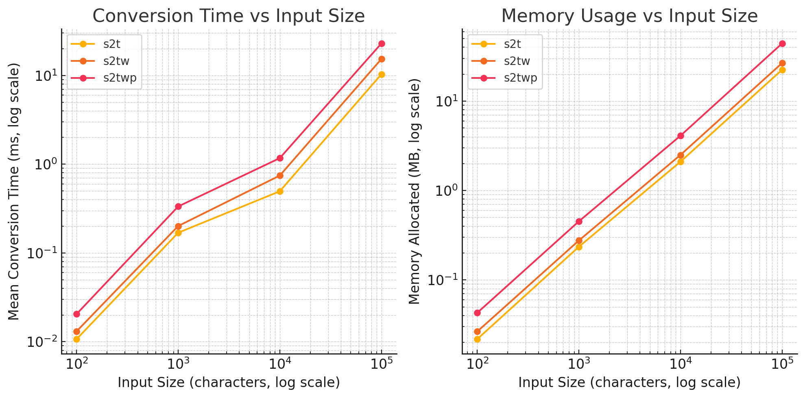

# OpenccNet

[](https://www.nuget.org/packages/OpenccNetLib/)

[](https://github.com/laisuk/OpenccNet/blob/main/LICENSE)

**OpenccNetLib** is a fast and efficient .NET library for converting Chinese text, offering support for Simplified ↔ Traditional, Taiwan, Hong Kong, and Japanese Kanji variants. Built with inspiration from [OpenCC](https://github.com/BYVoid/OpenCC), this library is designed to integrate seamlessly into modern .NET projects with a focus on performance and minimal memory usage.

## Table of Contents
- [Installation](#installation)
- [Usage](#usage)
- [API Reference](#api-reference)
- [Dictionary Files](#dictionary-files)
- [Add-On Tools](#add-on-tools)
- [License](#license)

## Features

- Fast, multi-stage conversion using static dictionary caching
- Supports:
  - Simplified ↔ Traditional Chinese
  - Taiwan ↔ Simplified/Traditional
  - Hong Kong ↔ Simplified/Traditional
  - Japanese Kanji ↔ Traditional
- Optional punctuation conversion
- Thread-safe and suitable for parallel processing
- .NET Standard 2.0 compatible

## Installation

- Add the library to your project via NuGet or reference the source code directly.
- Add required dependencies of dictionary files to library root.
	- `dicts\dictionary_maxlength.zstd` Default dictionary file.
	- `dicts\*.*` Others dictionary files for different configurations.

Install via NuGet:

```bash
dotnet add package OpenccNetLib
```

Or, clone and include the source files in your project.

## Usage

### Basic Example

```csharp
using OpenccNetLib;
var opencc = new Opencc("s2t"); // Simplified to Traditional 
string traditional = opencc.Convert("汉字转换测试"); 
Console.WriteLine(traditional);
// Output: 漢字轉換測試
```

### Supported Configurations

| Config   | Description                                 |
|----------|---------------------------------------------|
| s2t      | Simplified → Traditional                    |
| t2s      | Traditional → Simplified                    |
| s2tw     | Simplified → Traditional (Taiwan)           |
| tw2s     | Traditional (Taiwan) → Simplified           |
| s2twp    | Simplified → Traditional (Taiwan, phrases)  |
| tw2sp    | Traditional (Taiwan, phrases) → Simplified  |
| s2hk     | Simplified → Traditional (Hong Kong)        |
| hk2s     | Traditional (Hong Kong) → Simplified        |
| t2tw     | Traditional → Traditional (Taiwan)          |
| tw2t     | Traditional (Taiwan) → Traditional          |
| t2twp    | Traditional → Traditional (Taiwan, phrases) |
| tw2tp    | Traditional (Taiwan, phrases) → Traditional |
| t2hk     | Traditional → Traditional (Hong Kong)       |
| hk2t     | Traditional (Hong Kong) → Traditional       |
| t2jp     | Traditional → Japanese Kanji                |
| jp2t     | Japanese Kanji → Traditional                |

### Example: Convert with Punctuation

```csharp
var opencc = new Opencc("s2t"); 
string result = opencc.Convert("“汉字”转换。", punctuation: true);
Console.WriteLine(result);
// Output: 「漢字」轉換。
```

### Example: Switching Config Dynamically

```csharp
var opencc = new Opencc("s2t"); 
string result = opencc.Convert("动态切换转换方式");
Console.WriteLine(result);  // Output: 動態切換轉換方式
opencc.Config = "t2s";
result = opencc.Convert("動態切換轉換方式");
Console.WriteLine(result);  // Output: 动态切换转换方式
```

### Direct API Methods

You can also use direct methods for specific conversions:

```csharp
using OpenccNetLib;
var opencc = new Opencc();
opencc.S2T("汉字");      
// Simplified to Traditional opencc.T2S("漢字");      
// Traditional to Simplified opencc.S2Tw("汉字");     
// Simplified to Taiwan Traditional opencc.T2Jp("漢字");     
// Traditional to Japanese Kanji
// ...and more
```

### Error Handling

If an error occurs (e.g., invalid config), use:

```csharp
string error = opencc.GetLastError();
Console.WriteLine(error); // Output the last error message
```

### Language Detection

Detect if a string is Simplified, Traditional, or neither:

```csharp
using OpenccNetLib;
int result = Opencc.ZhoCheck("汉字"); // Returns 2 for Simplified, 1 for Traditional, 0 for neither
Console.WriteLine(result); // Output: 2 (for Simplified)
```

## Dictionary Files

Ensure the necessary dictionary files are included in your project. Add the following to your `.csproj`:

```xml
<ItemGroup>
  <None Update="dicts\dictionary_maxlength.cbor">
    <CopyToOutputDirectory>PreserveNewest</CopyToOutputDirectory>
    <Pack>true</Pack>
    <PackagePath>contentFiles\any\any\dicts\dictionary_maxlength.cbor</PackagePath>
  </None>
  <!-- Repeat for other dictionary files -->
</ItemGroup>
```

### Using Custom Dictionary

Library default to use zstd compressed dictionary Lexicon. 
It can be changed to use custom dictionary (JSON, CBOR or "baseDir/*.txt") prior to instantiate Opencc() :
```csharp
using OpenccNetLib;
Opencc.UseCustomDictionary(DictionaryLib.FromDicts()) // Init only onece, dicts from baseDir "./dicts/"
var opencc = new Opencc("s2t"); // Simplified to Traditional 
string traditional = opencc.Convert("汉字转换测试"); 
Console.WriteLine(traditional); // Output: 漢字轉換測試
```

## Performance

- Uses static dictionary caching and thread-local buffers for high throughput.
- Suitable for batch and parallel processing scenarios.

## Benchmarks

```
BenchmarkDotNet v0.15.0, Windows 11 (10.0.26100.4061/24H2/2024Update/HudsonValley).NET SDK 9.0.300
[Host]     : .NET 9.0.5 (9.0.525.21509), X64 RyuJIT AVX2
Job-TNXPUN : .NET 9.0.5 (9.0.525.21509), X64 RyuJIT AVX2
```

| Size	   | s2t Time (ms)	 | s2tw Time (ms)	 | s2twp Time (ms)	 | s2t Memory (MB)	 | s2tw Memory (MB)	 | s2twp Memory (MB) |
|:--------|---------------:|----------------:|-----------------:|-----------------:|------------------:|------------------:|
| 100     |        0.0107	 |         0.0131	 |          0.0205	 |          0.0218	 |           0.0265	 |            0.0429 |
| 1,000   |         0.169	 |          0.201	 |           0.334	 |           0.235	 |            0.276	 |             0.452 |
| 10,000  |         0.495	 |          0.744	 |            1.17	 |             2.1	 |              2.5	 |               4.1 |
| 100,000 |          10.3	 |           15.3	 |            22.9	 |            22.4	 |             26.6	 |              44.1 |



## API Reference

### `Opencc` Class

- `Opencc(string config = null)`  
  Create a new converter with the specified configuration.

- `string Convert(string inputText, bool punctuation = false)`  
  Convert text according to the current config.

- `string S2T(string inputText, bool punctuation = false)`  
  Simplified → Traditional

- `string T2S(string inputText, bool punctuation = false)`  
  Traditional → Simplified

- ... (see source for all conversion methods)

- `string GetLastError()`  
  Get the last error message.

- `static int ZhoCheck(string inputText)`  
  Detect if text is Simplified, Traditional, or neither.

## Dictionary Data

- Dictionaries are loaded and cached on first use.
- Data files are expected in the `dicts/` directory (see `DictionaryLib` for details).

## Add-On Tools

### OpenccNet dictgen

```
Description:
  Generate OpenccNetLib dictionary files.

Usage:
  OpenccNet dictgen [options]

Options:
  -f, --format <cbor|json|zstd>  Dictionary format: [zstd|cbor|json] [default: zstd]
  -o, --output <output>          Output filename. Default: dictionary_maxlength.<ext>
  -b, --base-dir <base-dir>      Base directory containing source dictionary files [default: dicts]
  -?, -h, --help                 Show help and usage information
```

### OpenccNet convert

```
Description:
  Convert text using OpenccNetLib configurations.

Usage:
  OpenccNet convert [options]

Options:
  -i, --input <input>               Read original text from file <input>.
  -o, --output <output>             Write converted text to file <output>.
  -c, --config <config> (REQUIRED)  Conversion configuration: [s2t|s2tw|s2twp|s2hk|t2s|tw2s|tw2sp|hk2s|jp2t|t2jp]
  -p, --punct                       Punctuation conversion: True|False [default: False]
  --in-enc <in-enc>                 Encoding for input: [UTF-8|UNICODE|GBK|GB2312|BIG5|Shift-JIS] [default: UTF-8]
  --out-enc <out-enc>               Encoding for output: [UTF-8|UNICODE|GBK|GB2312|BIG5|Shift-JIS] [default: UTF-8]
  -?, -h, --help                    Show help and usage information
```

## Project That Use OpenccNetLib

- [OpenccNetLibGui](https://github.com/laisuk/OpenccNetLibGui) : A GUI application for `OpenccNetLib`, providing a user-friendly interface for Chinese text conversion.

## License

This project is licensed under the MIT License. See the [LICENSE](LICENSE.txt) file for details.

---

**OpenccNet** is not affiliated with the original **OpenCC** project, but aims to provide a compatible and high-performance solution for .NET developers.

